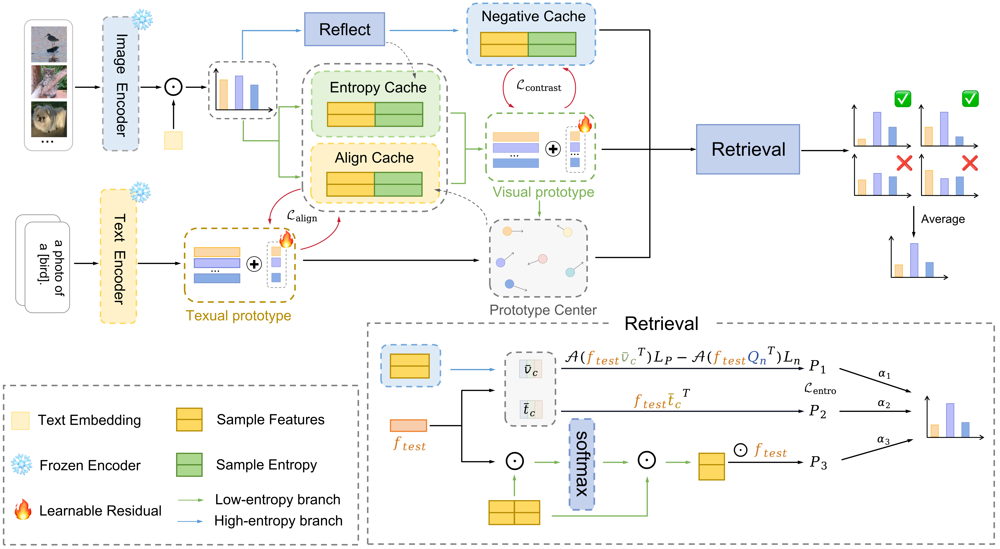

# [ICCV2025]MCP: Multi-Cache Enhanced Prototype Learning for Test-Time Generalization of Vision-Language Models

> **Official Implementation of "MCP: Multi-Cache Enhanced Prototype Learning for Test-Time Generalization of Vision-Language Models" (ICCV 2025)**  
> 🔗 Read our paper: [arxiv](https://arxiv.org/pdf/2508.01225) 

---

## Overview
🚀 This repository contains the official implementation of **MCP (Multi-Cache Enhanced Prototype Learning)**, proposed in our ICCV 2025 paper.  
MCP introduces a multi-cache mechanism that dynamically maintains prototype representations during test-time adaptation (TTA) of vision-language models (VLMs), enabling robust generalization under distribution shifts.

<p align="center">
  
</p>

> Abstract: In the zero-shot setting, test-time adaptation adjusts pre-trained models using unlabeled data from the test phase to enhance performance on unknown test distributions. Existing cache-enhanced TTA methods rely on a low-entropy criterion to select samples for prototype construction, assuming intra-class compactness. However, low-entropy samples may be unreliable under distribution shifts, and the resulting prototypes may not ensure compact intra-class distributions. This study identifies a positive correlation between cache-enhanced performance and intra-class compactness. Based on this observation, we propose a Multi-Cache enhanced Prototype-based Test-Time Adaptation (MCP) featuring three caches: an entropy cache for initializing prototype representations with low-entropy samples, an align cache for integrating visual and textual information to achieve compact intra-class distributions, and a negative cache for prediction calibration using high-entropy samples. We further develop **MCP++**, a framework incorporating cross-modal prototype alignment and residual learning, introducing prototype residual fine-tuning. Comparative and ablation experiments across 15 downstream tasks demonstrate that the proposed method and framework achieve state-of-the-art generalization performance.

## Installation

```bash
git clone https://github.com/CenturyChen/MCP.git
cd MCP
conda create -n mcp python=3.10
conda activate mcp
conda install pytorch==1.12.1 torchvision==0.13.1 torchaudio==0.12.1 cudatoolkit=11.3 -c pytorch
pip install -r requirements.txt
```

## Dataset

📦 For dataset preparation, please follow the instructions provided in [DATASETS.md](https://github.com/kdiAAA/TDA/blob/main/docs/DATASETS.md).  
Our implementation follows the same dataset setup protocol as **TDA**, covering the two standard benchmarks used in test-time adaptation.

## Run MCP
### OOD Benchmark
- ResNet50: Run MCP on the OOD Benchmark using the ResNet50 model:
```bash
bash ./scripts/run_ood_benchmark_rn50.sh 
```
- ViT-B/16: Run MCP on the OOD Benchmark using the ViT-B/16 model:
```bash
bash ./scripts/run_ood_benchmark_vit.sh 
```
### Cross-Domain Benchmark
- ResNet50: Run MCP on the Cross-Domain Benchmark using the ResNet50 model:
```bash
bash ./scripts/run_ood_benchmark_rn50.sh 
```
- ViT-B/16: Run MCP on the Cross-Domain Benchmark using the ViT-B/16 model:
```bash
bash ./scripts/run_ood_benchmark_vit.sh 
```

## Citation

🤗 If you find our work useful, please consider citing:

```bibtex
@inproceedings{chen2025mcp,
  title={Multi-Cache Enhanced Prototype Learning for Test-Time Generalization of Vision-Language Models},
  author={Chen, Xinyu and Zhai, Haotian and Zhang, Can and Shi, Xiupeng and Li, Ruirui},
  booktitle={Proceedings of the IEEE/CVF International Conference on Computer Vision},
  year={2025}
}
```
## Acknowledgements

This research is inspired by previous works including [Tip-Adapter](https://github.com/gaopengcuhk/Tip-Adapter), [TPT](https://github.com/azshue/TPT), [CuPL](https://github.com/sarahpratt/CuPL), [TDA](https://github.com/kdiAAA/TDA), and [DPE-CLIP](https://github.com/zhangce01/DPE-CLIP). We appreciate their valuable open-source efforts.
